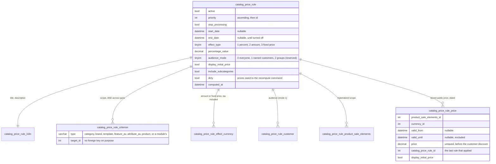
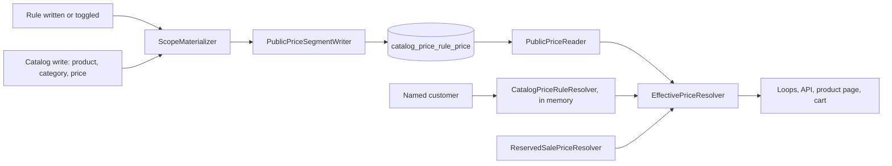

# Catalog price rules

A merchant writes "20% off the Winter category in January", "9.90 on brand X for
these customers", and the prices of the catalog follow: in the listings, on the
product page, in the cart, on the invoice and through the API, without touching a
single product sheet. A product filed in the Winter category on January 15th is
priced by the rule from that moment; the rule stops at midnight on February 1st
without anything having to run.

A rule is made of three things. A **scope**: criteria combined with AND - categories
(with or without the categories below them), brands, templates, feature values,
attribute values, named products - the targets of one type combined with OR, an
absent type meaning "all". An **audience**: everyone, or the customers named on the
rule (customer groups are modeled, US #122 will fill the mode). An **effect**: a
percentage off, an amount off per currency, or a fixed price per currency, the
amounts and prices being typed tax included at the shop location, like the offsets
of a flash sale. On top of that a priority, a stop flag, dates, and whether the
catalog price is shown struck through.

Two rules covering the same sale element apply by ascending priority, then by
ascending id, each on what the previous one left; a rule asking to stop processing
is the last one examined. A rule prices from the catalog price (`product_price.price`)
and **replaces** the promo price the visitor would otherwise see, a manual promo or a
running flash sale included: that is a decision of the ticket, and it means a flash
sale covered by a rule shows the rule price while the rule runs. Nothing is ever
written into `product_price` or `product_sale_elements.promo`, so the manual promo
price is back the second the rule ends. A price a rule would take below zero is
floored at zero and logged.

This document is the map for developers who work on the feature. The behavior itself
is specified by the test suites named below.

## Data model



`catalog_price_rule_criterion.target_id` carries no foreign key on purpose: a
deleted category or brand must match nothing, not turn its criterion into "all" and
widen the rule to the whole shop. The back-office list flags such criteria.

## Where the price lives

Two derived tables, both rebuilt from the rules and the catalog by
`Thelia\Domain\Pricing\Rule\RuleRepricer`, never edited by hand.

`catalog_price_rule_product_sale_elements` is the **materialized scope**: which sale
elements each rule covers, as last derived from its criteria by
`Scope\ScopeMaterializer` - one `INSERT ... SELECT` per rule, whatever the size of the
catalog. It is what the back office counts, what the price writer prices, and what
the resolver joins for a named customer.

`catalog_price_rule_price` holds the **stored public price**: for every sale element
a public rule covers, per visible currency, the price the chain of public rules gives
it, cut into dated segments by `Engine\PriceSegmentBuilder`. Every start and end date
of the covering rules is a boundary; between two boundaries the set of running rules
is constant and the chain is evaluated once. A reader picks the segment the current
instant falls in:

```sql
valid_from IS NULL OR valid_from <= :now
AND (valid_until IS NULL OR valid_until > :now)
```

so an opening or a closing takes effect at the second, without waiting for the
scheduled command - the very limitation the flash sales have.

A rule reserved for named customers stores nothing: `CatalogPriceRuleResolver`
prices the sale elements asked for on the spot, chaining the public rules and the
customer's own with the same engine, bounded by the sale elements of the page and
never by the size of the rule.



## Arithmetic

All in `Thelia\Domain\Pricing\Rule\Engine`, pure and unit-tested with a flat-rate tax
calculator.

```
taxed    = taxCalculator->getTaxedPrice(untaxed)
percent  : taxed' = taxed * (1 - p / 100)
amount   : taxed' = max(0, taxed - a)        # a typed per currency
fixed    : taxed' = f                         # f typed per currency
untaxed' = taxCalculator->getUntaxedPrice(taxed')
```

The percentage and the amount go through `Thelia\Domain\Sale\SaleDiscountCalculator`,
so a rule and a flash sale with the same offset agree to the cent. Floats travel
through the chain and are rounded to six decimals when stored (`DECIMAL(16,6)`). The
customer discount is applied on top by the readers, exactly as it is applied to a
promo price; the stored price never includes it. `display_initial_price` of a result
is the OR of the applied rules.

## Order of the mechanisms

`EffectivePriceResolver` combines, per sale element: the rule price, which replaces
the catalog promo; then a reserved operation the customer is named on, which applies
only when it beats what the customer would otherwise pay (the frozen decision of the
reserved sales). `EffectivePriceCatalog` memoises the answer per request, warmed by
the page and read by the row.

The seams are those the reserved sales opened: the `product` and
`product_sale_elements` loops (virtual columns `promo_price`, `is_promo`,
`display_initial_price`), `ProductSaleElementsAccessService::psesByProduct()` (the
product page), `Api\EventListener\EffectivePriceListener` on the front read of a sale
element (warmed for a page by `EffectivePriceCollectionWarmer` on the new
`CollectionModelsLoadedEvent`), and `Thelia\Action\Cart`, which writes the price into
`cart_item.promo_price` - what `order_product` then freezes, so an order keeps the
price it was placed at after the rule ends.

The `product` loop also joins the stored public price for its `min_price` and
`max_price` orders and filters, when a public rule is turned on and outside the back
office. What a named customer alone is entitled to stays out of the orders: a page
ordered by price orders such a customer's catalog by its public prices, as for a
reserved sale. The `promo="1"` loop filter still reads `product_sale_elements.promo`
and knows nothing of the rules.

## Keeping the stored prices in step

| Change | Handled by | Reaction |
| --- | --- | --- |
| Rule created, changed, toggled, deleted | `Thelia\Action\CatalogPriceRule` | scope rematerialized, what left or entered it repriced |
| Product created, updated, categories, template, feature values, sale elements, clone | `Thelia\Action\CatalogPriceRuleCatalogSync` | the product re-evaluated against every rule, its sale elements repriced |
| Category updated or deleted | same | every rule naming a category rematerialized (the tree below may have moved) |
| Brand, template, feature value, attribute value deleted | same | the rules naming it rematerialized |
| Tax, tax rule, currency created, updated, rates | same | every turned-on rule marked dirty |
| Catalog write through the admin API | `Api\EventListener\CatalogPriceRuleResourceSyncListener` on `ResourcePersistedEvent` | the product re-evaluated, as after a back-office edit |
| Product or sale element deleted | foreign keys | scope rows and segments cascade |

A change touching more sale elements than `catalog_price_rule_inline_recompute_limit`
(a shop setting, 5000 by default) is not replayed in the request: the rule is marked
`dirty` and the command finishes it.

```
php bin/console catalog-price-rule:recompute            # dirty rules + purge of the segments already over
php bin/console catalog-price-rule:recompute --full     # rebuild everything
php bin/console catalog-price-rule:recompute --rule=12
php bin/console catalog-price-rule:recompute --product=340
```

Schedule it alongside `sale:check-activation`; every few minutes is plenty, since
the dates are carried by the segments and the command only catches up what the
events could not finish.

## Shared API cache

A public rule prices everyone the same, so `/api/front/products` and
`/api/front/product_sale_elements` stay cacheable while one runs; a segment
boundary inside the TTL is the same class of staleness as a flash sale today. A
rule reserved for named customers makes the answer depend on who is asking: those
two prefixes bypass the cache while one runs, exactly as for a reserved sale
(`PricingActivityChecker::hasVisitorDependentPricing()`). The cache is flushed on
every `CATALOG_PRICE_RULE_*` event and by the recompute command.

## Extension points

- `Scope\ScopeCriterionResolverInterface` (tag `thelia.catalog_price_rule.criterion`):
  a module adds a criterion type by shipping one resolver returning the SQL predicate
  over the `pse` and `p` aliases. A type no installed resolver answers for makes the
  rule cover nothing.
- `Audience\AudienceResolverInterface` (tag `thelia.catalog_price_rule.audience`):
  customer groups (US #122) plug in here.
- `Thelia\Domain\Pricing\CatalogPriceResolverInterface`: the contract a module pricing
  by rules of its own decorates, answering for the sale elements it covers and handing
  the rest to the core resolver.

## Where things live

| Piece | Place |
| --- | --- |
| Tables, seeds, migration | `local/config/schema.xml`, `setup/insert.sql.tpl`, `setup/update/sql/3.2.0.sql` |
| Engine (pure) | `core/lib/Thelia/Domain/Pricing/Rule/Engine/` |
| Scope, audience, storage | `core/lib/Thelia/Domain/Pricing/Rule/{Scope,Audience,Storage}/` |
| Resolution and combination | `core/lib/Thelia/Domain/Pricing/{EffectivePriceResolver,EffectivePriceCatalog,PricingActivityChecker}.php` |
| Validation, repricing, preview, overview, conversion | `core/lib/Thelia/Domain/Pricing/Rule/` |
| Events and actions | `core/lib/Thelia/Core/Event/CatalogPriceRule/`, `core/lib/Thelia/Action/CatalogPriceRule*.php` |
| Command | `core/lib/Thelia/Command/CatalogPriceRuleRecomputeCommand.php` |
| Admin API (read only) | `core/lib/Thelia/Api/Resource/CatalogPriceRule.php` |
| Back-office screens | `default-twig` theme, `/admin/catalog-price-rule` |

## Converting a flash sale

`Conversion\SaleToPriceRuleConverter::convert(Sale)` builds turned-off rules from a
sale through the creation event: dates, audience and customers, percentage or amount
per currency, and the products as named-product criteria. A sale selects (product,
attribute value) pairs with OR, which a rule cannot express in one AND: the pairs are
grouped by their set of attribute values and each group becomes one rule, with a
warning. The sale is left as it is.

## Test suites

- `tests/Unit/Domain/Pricing/Rule/Engine/`
- `tests/Integration/Domain/Pricing/Rule/` (scope, storage, resolver, preview, overview, conversion)
- `tests/Integration/Action/CatalogPriceRule{Action,CartAction,CatalogSync}Test.php`
- `tests/Integration/Core/Template/CatalogPriceRuleProductLoopTest.php`
- `tests/Integration/Api/Service/DataAccess/ProductSaleElementsAccessRulePriceTest.php`
- `tests/Integration/Command/CatalogPriceRuleRecomputeCommandTest.php`
- `tests/Api/Front/CatalogPriceRulePriceApiTest.php`, `tests/Api/Admin/CatalogPriceRule{Api,ResourceSync}Test.php`
- `tests/Http/Flexy/CatalogPriceRuleShowcaseTest.php`
