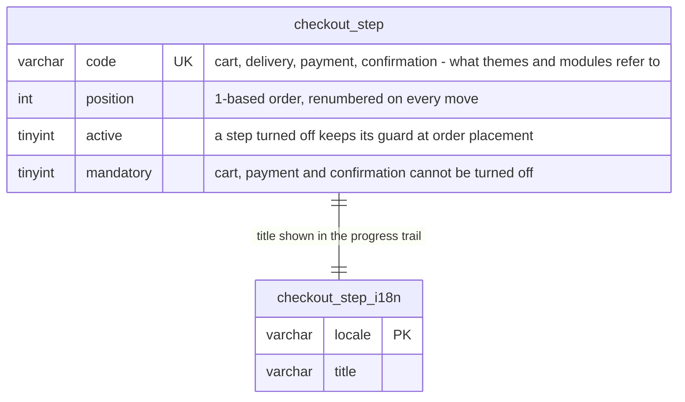
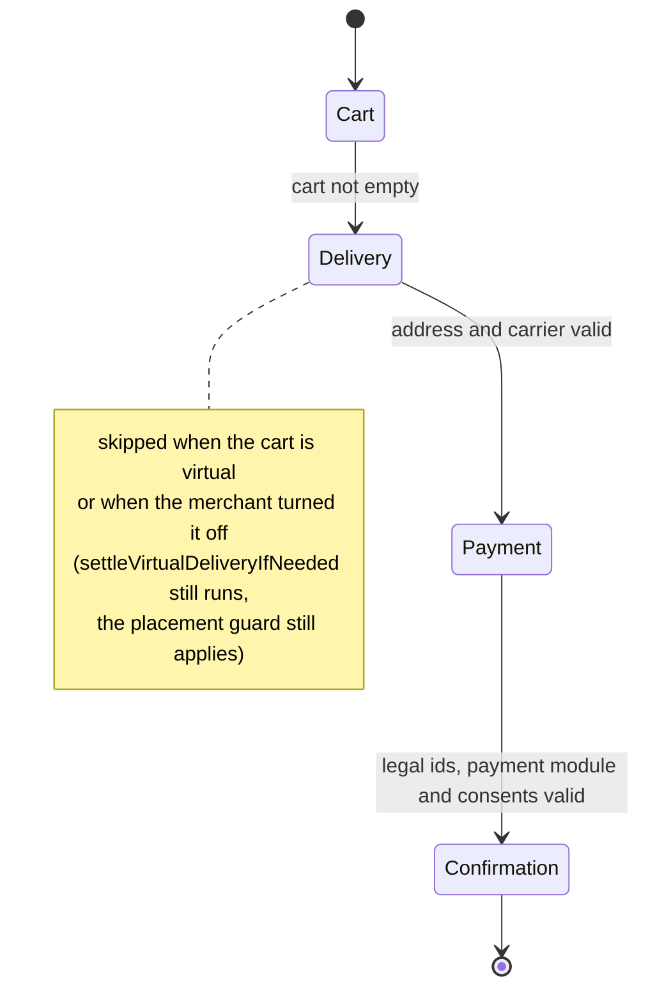

# Configurable checkout steps and display form

The checkout used to be written into the theme: three pages plus a
confirmation, each page checking the cart by hand and redirecting on its own.
It is now described by configuration: an ordered list of steps stored in the
database, each step bound to the guard it demands, and a shop setting that
picks the display form — one page per step, as before, or every step stacked
on a single screen.

A merchant can turn off a step the shop does not use (a download-only shop
drops the delivery step). Turning a step off removes its screen, never its
check: `CheckoutValidationService::validateForOrder()` runs the `check()` of
every registered step provider when the order is placed — the four of the core
and any a module ships — in declared-position order, and reads neither the
`active` flag nor `isSkippedFor()` to decide which. The cart opens the tunnel,
the payment comes next to last and the confirmation closes it; the back office
refuses any other shape, and a configuration broken behind its back falls back
to the defaults with a log warning instead of refusing to render.

Deploy the SQL before the code: `checkout_step` is read on every page of the
tunnel, and a missing table falls back to the providers' defaults with a log
warning rather than 500-ing the whole checkout.

This document is the map for developers who work on the feature. The behavior
itself is specified by the test suites named below.

## Data model

One table and its i18n companion, seeded with the four historical steps, plus
the `checkout_display_mode` config key (`steps`, the default, or `one_page`).

The rows carry the merchant's choices (order, activation, wording). What a
step *does* — its guard, whether a cart may skip it, which component a theme
might render it with — lives in code, on a `CheckoutStepProviderInterface`
service tagged `thelia.checkout.step_provider`. A module adds a step by
shipping one such service; the row appears on the back-office screen at the
next visit through the synchronize event. A row whose provider is gone
(uninstalled module) is kept but excluded from the tunnel.

`componentName()` is a hint and nothing more. The four core providers answer
`null`: naming a component is the theme's business, and the theme maps the core
codes itself (`componentFor(code) ?? $step->componentName`). A module shipping a
step no theme has heard of is where the hint earns its place.

Titles are resolved in one place, `CheckoutStepTitleResolver::titleOf(step,
?locale)`: asked locale, then shop language, then any locale actually written,
then the code — never the `DEFAULT TITLE` placeholder `I18n` forges.

## Progression

`CheckoutProgressionService` is the single authority on where a cart stands:

- `activeSteps(Cart, ?locale)` — the ordered active steps, minus the ones the
  cart skips (a virtual cart skips delivery);
- `firstIncompleteStep(Cart)` — the first step whose guard throws;
- `isReachable(Cart, code)` — whether every step before `code` passes.

It never reads the session: the cart is always passed in, so the CLI and the
front API (#116) consume it the same way the theme does. The one indirect
session read left — the payment step checks the buyer's consents — goes
through `ConsentAcceptanceReaderInterface`, whose default implementation is
the session store; a sessionless consumer swaps the reader instead of the
service. Results are memoised per cart *and per state of that cart* for the
request — the key carries the cart timestamp and the choices made on it, so a
saved change invalidates itself; `forget()` remains for what the key cannot see
(a step row that moved, a consent toggled) and `kernel.reset` for persistent
runtimes. The tunnel shape rule — cart first, payment next to last,
confirmation last — lives in `CheckoutTunnelShape`, shared by the read-side
fallback and the write-side refusals, and `CheckoutStepQuery::orderedByTunnel()`
is the one ordering (position, then code) every reader of the table uses.

A cart with nothing to ship skips the delivery step on screen and still needs
the carrier the order cannot be placed without:
`CheckoutFacade::settleVirtualDeliveryIfNeeded(Cart)` settles it, once, and
does nothing to any other cart. The rule is the core's, not a theme's.

The theme asks `isReachable()` before serving a step page and redirects to the
first incomplete step otherwise — no more per-exception redirect maps. In the
one-page form the same steps are stacked in an accordion — the theme's own
Accordion molecule, in its documented h4 variant — and the screen carries no
progress trail: the sections themselves say what is settled and what is left.
A locked section is an unrendered section, and unlocking is display only: the
refusal at placement stays on the server.

Two deliberate trade-offs in the theme. The next-step button re-renders on
every live event, so it settles for cheap column reads over the active step
list instead of running the guards — a full `firstIncompleteStep()` would ask
the carrier for a postage quote on every ticked box. And the confirmation
page draws its trail from the step codes snapshotted at placement, because
the cart it would otherwise read has just been emptied and would put the
skipped delivery step back on screen.

## Where things live

| Piece | Place |
|---|---|
| Table, seeds, migration | `local/config/schema.xml`, `setup/insert.sql.tpl`, `setup/update/sql/3.1.0.sql` |
| Step contract and core steps | `core/lib/Thelia/Domain/Checkout/Service/Step/` |
| Progression and configuration services | `core/lib/Thelia/Domain/Checkout/Service/` |
| Display form enum | `core/lib/Thelia/Domain/Checkout/Enum/CheckoutDisplayMode.php` |
| Back-office events | `core/lib/Thelia/Core/Event/CheckoutStep/`, handled by `Thelia\Action\CheckoutStep` |
| Back-office screen | `default-twig` theme, `/admin/configuration/checkout-step` |
| Theme rendering, both forms | Flexy theme, `src/Controller/CheckoutController.php` and `checkout-*.html.twig` |

## Test suites

- `tests/Unit/Domain/Checkout/CheckoutDisplayModeTest.php`
- `tests/Integration/Domain/Checkout/CheckoutProgressionTest.php`
- `tests/Integration/Domain/Checkout/CheckoutPlacementGuardsTest.php`
- `tests/Integration/Domain/Checkout/CheckoutStepConfigurationTest.php`
- `tests/Integration/Domain/Checkout/CheckoutStepTableMissingTest.php`
- `tests/Integration/Domain/Checkout/VirtualCartDeliveryTest.php`
- `tests/Http/BackOffice/CheckoutStepConfigurationTest.php`
- `tests/Http/Flexy/ConfigurableCheckoutTest.php`
