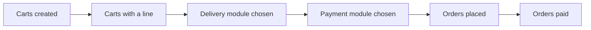

# Checkout conversion report

A merchant asks "how many of my carts turn into paid orders, and where do they
drop off". The back office answers with a checkout funnel: `admin.reports.conversion`,
`/admin/reports/conversion`. It reads the `cart`, `cart_item` and `order` tables
of a period and counts, nothing more: no tag, no cookie, no page view. A shop
that wants "how many visits reached the cart page" still needs a web analytics
tool; this screen starts at the first cart row.

The screen needs the `admin.order` resource. A second tab, "Searches without
result", needs `admin.product` and is hidden without it. The export link needs
`admin.export`.

This document is the map for developers who work on the feature. The behavior
itself is specified by the test suites named below.

## Period and tabs

Two query parameters, both optional:

- `period`: one of the dashboard presets (`today`, `7days`, `30days`,
  `90days`, `month`, `year`), default `30days`.
- `current_tab`: `funnel` (default) or `search`.

## The six steps

`Thelia\Domain\Report\ConversionFunnel\ConversionFunnelCalculator::total()`
counts the period once; `daily()` counts it day by day for the export. Both
run two queries: one pass on `cart` joined to `cart_item`, one pass on `order`.
The four cart steps are nested (a cart reaches a step only if it reached the
one before it), because the join keeps `cart_item.cart_id` null for a cart
that never qualifies for the previous step.

1. **Carts created**: one `cart` row per cart in the period, on
   `cart.created_at`. A row is written at the first add-to-cart, but also when
   the cart page is displayed, even empty, so this step includes carts a bot
   or a curious visitor never put a line into.
2. **Carts with at least one line**: a `cart_item` row that is not a line a
   promotion offered (`is_offered = 0`). This step is the denominator of the
   conversion rate below.
3. **Delivery module chosen**: `cart.delivery_module_id` is not null. A lower
   bound: the checkout writes it when the shopper clicks a carrier, and clears
   it when the shopper goes back to the cart page, changes the delivery
   address, or when the postage computation fails.
4. **Payment module chosen**: `cart.payment_module_id` is not null, same
   nature as the step before: written on a click, cleared on a return to the
   cart page. Nothing pre-selects a payment module.
5. **Orders placed**: `order` rows created in the period, counted on the
   order table alone. An order whose cart was purged since stays counted, and
   several orders can share one cart: a cancelled attempt and a retry both
   count.
6. **Orders paid**: orders whose status carries the effective code `paid`,
   `processing` or `sent`. A custom status counts through the code it was
   given as equivalent; `refunded` and `canceled` do not, whatever code they
   are built from.

Each step displays its count, its share of the step before it, and its share
of step 2. The conversion rate is orders paid divided by carts with at least
one line, and the screen prints the formula next to the figure, because every
analytics tool defines "conversion rate" a little differently.



## Cart purge and the lower bound

`maintenance:purge` deletes anonymous carts older than
`purification_cart_anonymous_days` (default 30) and customer carts without an
order older than `purification_cart_no_order_days` (default 60), both counted
from the creation date. `Thelia\Domain\Cart\Service\CartPurgeHorizon` exposes
that horizon (`earliestSurvivingCartDate()`, `mayHavePurged()`), taking the
shorter of the two settings.

When the requested period starts before that horizon, the screen warns that
the four cart steps are a lower bound for the part of the period the purge may
have reached. The deleted carts never placed an order, so the two order steps
are unaffected and are never purged. Nothing runs `maintenance:purge`
automatically: a shop that never schedules it keeps its whole cart history, and
the warning then overstates the risk, because it only reads the configured
retention, not whether the command ever ran.

## Searches without result

The second tab reads the search log of the optional TntSearch module, product
index only, grouped by term and locale, keeping the terms whose last search
found nothing. The core never references the module's classes, which only
exist once the module is installed. `SearchLogReaderFactory` reads the module
row to know whether it is active, `TntSearchSchemaProbe` asks
`information_schema` whether `tnt_search_log` exists and whether it carries
`search_count`, and `TntSearchLogReader` reads the table with plain SQL behind
the `SearchLogReader` interface.

TntSearch 4.0 writes one row per term and locale and overwrites the hit count
on every search: the list the tab shows is alphabetical, with no indication of
how often a term was searched. From TntSearch 4.1, the module also maintains a
`search_count` column; the reader then sorts the zero-result list by number of
searches and a second table lists the most searched terms overall
(`topSearchedTerms()`). `SearchLogAvailability` tells the template which case
it is in.

When the module is missing or inactive, the tab explains what to install
instead of showing an empty table. A button opens the module's synonyms
screen, `/admin/module/TntSearch/synonym`, so a merchant can turn a
zero-result term into a hit. Search terms are visitor input and are escaped
wherever they are displayed.

## Export

`thelia.export.conversion_funnel`, in the Reports category of the export
screen, which selects its period by month. From the CLI:

```bash
php Thelia export thelia.export.conversion_funnel thelia.csv --start=2026-01-01 --end=2026-01-31 --locale=en_US
```

One row per calendar day of the period, zero-filled: a day without a single
cart still gets a row of zeroes, so a quiet period yields a file rather than
nothing:

```
date, carts_created, carts_with_items, carts_with_delivery_module, carts_with_payment_module, orders_created, orders_paid
```

No daily conversion rate: the orders of a given day can come from carts
created on other days, so a per-day ratio would mislead. Without an explicit
period, the export covers the last twelve months up to today.

## Limits

- Steps 3 and 4 are a lower bound wherever the period reaches into purged
  history (see above).
- Step 1 counts empty carts: a bot or a visitor who never added a line still
  creates a row.
- A cart emptied after having had a line looks, at read time, like it never
  had one: step 2 is read from what is in `cart_item` now, not from what was
  ever there.
- Orders placed from the back office count in steps 5 and 6 the same as
  orders placed by a shopper.
- `cart.created_at` carries no index: both funnel queries do a full scan of
  the period. Measured at roughly 0.3 s for 200,000 carts on MariaDB 10.11.

## Where things live

| Piece | Place |
| --- | --- |
| Funnel calculator | `core/lib/Thelia/Domain/Report/ConversionFunnel/ConversionFunnelCalculator.php` |
| Cart purge horizon | `core/lib/Thelia/Domain/Cart/Service/CartPurgeHorizon.php` |
| Export | `core/lib/Thelia/Domain/DataTransfer/Export/Type/ConversionFunnelExport.php` |
| Search log reading | `default-twig` theme, `src/Service/Report/SearchLog/` |
| Back-office screen | `default-twig` theme, `/admin/reports/conversion` |

## Test suites

- `tests/Integration/Domain/Report/ConversionFunnel/ConversionFunnelCalculatorTest.php`
- `tests/Unit/Domain/Cart/CartPurgeHorizonTest.php`
- `tests/Integration/Domain/DataTransfer/ConversionFunnelExportTest.php`
- `templates/backOffice/default-twig/tests/Service/Report/SearchLog/TntSearchSchemaProbeTest.php`
- `templates/backOffice/default-twig/tests/Service/Report/SearchLog/TntSearchLogReaderTest.php`
