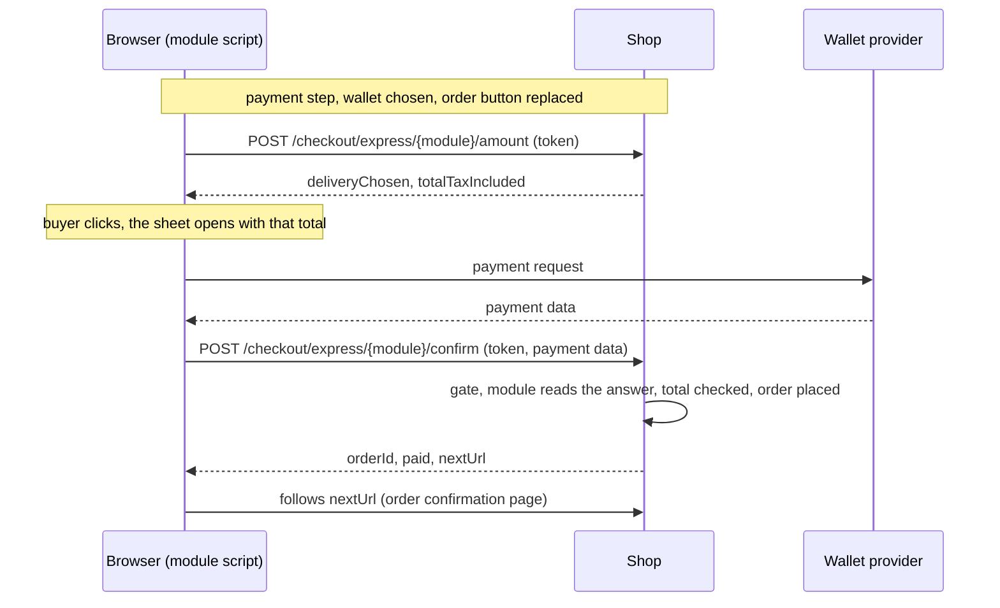

# Express payment in the checkout

A wallet such as Google Pay or Apple Pay can take the payment of the checkout. The buyer
goes through the tunnel as usual: they are identified, signed in or as a guest, and they
choose the addresses and the carrier. At the payment step the wallet is listed among the
payment methods, next to the cheque. Choosing it puts the wallet's own button in the place
of the order button, greyed until the order button would be live (consents ticked). The
wallet only pays: the order is made of what the checkout wrote on the cart.

Thelia knows nothing of any wallet. It provides the place, the amount the sheet charges,
the confirmation route and the order. A payment module provides the button, the script
behind it and the conversation with its provider.

Express payment is off in every shop until the merchant turns it on. A shop that upgrades
shows nothing new.

This document is the map for developers who write a wallet module or work on the feature.
The behavior itself is specified by the test suites named below.

## Flow

The script asks the amount again on every `checkout:summary-changed` browser event, which
the theme dispatches whenever the summary re-renders (carrier, address, quantity). It
calls the provider inside the buyer's click: wallets refuse a sheet opened outside a user
gesture.

## The module contract

A wallet module implements `Thelia\Module\ExpressPaymentModuleInterface` next to the usual
`PaymentModuleInterface`. Modules written before express payment existed are untouched:
the shop asks `instanceof` and passes over the rest.

| Method | What the module answers |
|---|---|
| `expressPaymentZones()` | The zones it can fill. Today only `ExpressPaymentZone::Checkout`. |
| `isAlsoOfferedAtCheckout()` | `false` for a wallet: the checkout never places an order with it. `true` for a module that also takes a card through the ordinary placement. |
| `expressPaymentButton(Cart, zone)` | The button to show for this cart, or `null`. Called on every render of the payment step, so it decides from what it already holds and never calls the provider. |
| `readExpressPaymentConfirmation(Request, Cart)` | What the wallet handed back, once the provider vouches for it: an `ExpressWalletAnswer` with the total the sheet showed and the consent answers. Throws `ExpressCheckoutRefusedException` otherwise. |

The answer names neither the cart nor the buyer: the shop already holds both. A module that
could name them could order someone else's cart. A module never writes a confirmation route
of its own, and never touches the session or the owner of the cart.

The `IsValidPaymentEvent` that filters the payment methods of the checkout filters the
buttons too. A module refused for an amount or a currency is not offered a way around it.

### Rendering the button

The theme gives express payment one hook, `checkout.express-payment`, rendered with the
payment step page in a hidden holder. The module reads its buttons from
`ExpressPaymentButtonCollector::collect($cart, ExpressPaymentZone::Checkout)` and renders
each one with:

- `data-express-payment-module="<module code>"` on its root element, which is how the theme
  finds it;
- the `amountUrl`, `confirmationUrl` and `confirmationToken` the collector added to the
  button. They belong to the shop, and a module does not build them.

Flexy's `express-payment-dock` Stimulus controller moves the chosen module's button into the
order button's slot, and makes it inert and faded while the slot says the order cannot be
placed yet. The button is rendered with the page rather than by the live component on
purpose: a `<script>` inserted by a LiveComponent re-render never runs.

## The shop's side

### Routes

Both routes are `POST` and answer JSON, because the caller is a script on a payment sheet.
The token travels in the `X-Express-Confirmation-Token` header or in the
`express_confirmation_token` field.

| Route | Answer |
|---|---|
| `express_checkout_amount`, `/checkout/express/{moduleCode}/amount` | `{deliveryChosen, totalTaxIncluded}`. `deliveryChosen` is false until a carrier and a delivery address are on the cart, and the button stays disabled. |
| `express_checkout_confirm`, `/checkout/express/{moduleCode}/confirm` | `{orderId, orderReference, orderStatus, paid, alreadyPlaced, nextUrl, paymentAction}`. `nextUrl` is the payment module's redirect when it asked for one, otherwise the theme's `checkout_confirm` page. |

| Status | Meaning |
|---|---|
| 403 | The token is not the one issued for this cart and module, or the module takes no express payment. A page left open after the cart changed answers this. |
| 409 | A placement of this cart is already running, or the stock ran out meanwhile. The same confirmation may go through a moment later. |
| 422 | A refusal whose message says the rule: no carrier chosen yet, a total that differs from the shop's, a buyer nobody identified, nothing to pay for. |

### Checks, in order

1. `ExpressCheckoutGate::open()`: an active payment module that implements the contract,
   a session cart with something in it, and a token signed for that cart and that module.
   Nothing in the request is read before this passes.
2. The module reads its provider's answer.
3. The cart must belong to the buyer the session holds. A cart that does not yet is bound
   to them. A session with no buyer is refused: this route never opens a guest.
4. `ExpressCheckoutPlacementService::place()`: the carrier, the invoice address and the
   delivery address must be on the cart. The wallet is written as the payment module, the
   postage is computed again, and the total is compared with what the sheet showed, to the
   cent. A difference places nothing.
5. `CheckoutPlacementService::place()`, the same door as the ordinary checkout: lock, cart
   fingerprint, refusal of a cart already ordered.
6. Once the order is paid, the session cart is read again so the guest leaves the session.
   Flexy's confirmation page replaces the cart without reading it, and the guest would
   otherwise stay for the next checkout on this browser.

The token is an HMAC of the cart id and the module id under `kernel.secret`. It is signed
rather than stored, and it dies with the cart: a cart replaced at sign-in or after a payment
has another id.

### The ordinary placement refuses an express-only module

`CheckoutPaymentOffer::canBePaidAtCheckout()` holds the rule: a module that implements the
contract and answers `false` to `isAlsoOfferedAtCheckout()` is paid by its own button only.
`ExpressPaymentCheckoutGuard` applies it in `CheckoutFacade::pay()` and in the API's
`CheckoutPlacementProcessor`, so a forged request or a stale page cannot call the module's
`pay()` without a sheet and mark the order paid with nothing taken. Flexy's order button
reads the same rule to decide when to give its place to the wallet.

## Setting

`express_payment_zones`, a comma-separated list of zones, empty by default. `checkout` turns
express payment on. Unknown entries are dropped rather than refused, so a value written by
another version degrades to the zones this one knows. Fresh installs get the row from
`setup/insert.sql`. Updated shops get it from `setup/update/sql/3.2.0.sql` with
`INSERT IGNORE`, which leaves alone a shop that already set it.

## API

`GET /api/front/payment/express-buttons?zone=checkout` lists the buttons for the cart in
hand, with the shop's routes and token, for a decoupled front.

## Writing a wallet module: checklist

- Implement both interfaces, list `ExpressPaymentZone::Checkout`, answer `false` to
  `isAlsoOfferedAtCheckout()` unless the module also takes payment through the ordinary
  placement.
- Register a theme hook on `checkout.express-payment`, render the collector's buttons with
  `data-express-payment-module`.
- Ask the amount route on load and on `checkout:summary-changed`, and keep the button
  disabled while `deliveryChosen` is false.
- Open the sheet inside the click, with the total from the amount route, and post the
  provider's data to the confirmation route with the token. Follow `nextUrl`.
- In `readExpressPaymentConfirmation()`, verify the payment with the provider and return the
  total the sheet showed. Throw a refusal when the provider does not vouch for it.

## Where things live

| Piece | Place |
|---|---|
| Module contract | `core/lib/Thelia/Module/ExpressPaymentModuleInterface.php` |
| Zone, button, answer | `core/lib/Thelia/Domain/Checkout/Enum/ExpressPaymentZone.php`, `DTO/ExpressPaymentButton.php`, `DTO/ExpressWalletAnswer.php` |
| Collector, gate, token, amount, confirmation, placement | `core/lib/Thelia/Domain/Checkout/Service/Express*` |
| Ordinary placement guard | `core/lib/Thelia/Domain/Checkout/Service/CheckoutPaymentOffer.php`, `ExpressPaymentCheckoutGuard.php` |
| Routes and controller | `core/lib/Thelia/Config/Resources/routing/routes.php`, `core/lib/Thelia/Controller/Front/ExpressCheckoutController.php` |
| API | `core/lib/Thelia/Api/Resource/ExpressPaymentButton.php`, `Api/State/Provider/ExpressPaymentButtonProvider.php` |
| Setting | `setup/insert.sql.tpl`, `setup/update/sql/3.2.0.sql` |
| Theme | Flexy: `checkout-payment.html.twig`, `checkout-onepage.html.twig`, `components/Organisms/NextButton/`, `components/Organisms/Summary/Checkout.php`, `assets/controllers/express_payment_dock_controller.js` |

## Test suites

- `tests/Unit/Domain/Checkout/ExpressPaymentZoneTest.php`
- `tests/Integration/Domain/Checkout/ExpressPaymentButtonCollectionTest.php`
- `tests/Integration/Domain/Checkout/ExpressCheckoutPlacementTest.php`
- `tests/Integration/Domain/Checkout/ExpressPaymentAtCheckoutTest.php`
- `tests/Api/Front/ExpressPaymentButtonApiTest.php`
- `tests/Http/Flexy/ExpressCheckoutConfirmationTest.php`
