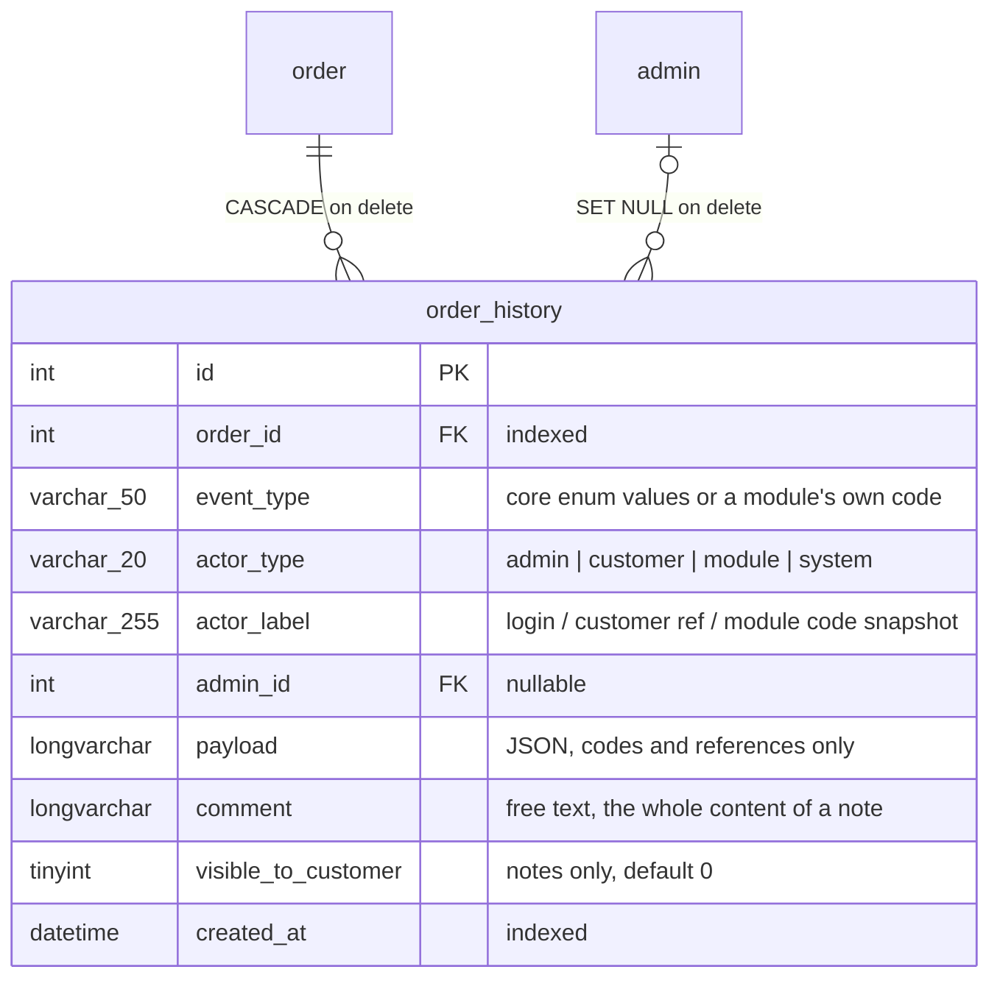
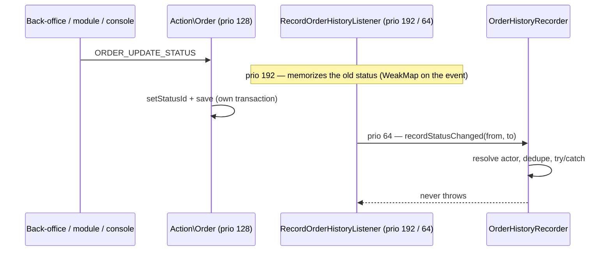

# Order history timeline

Every gesture that touches an order — its creation, each status change, a
corrected address, a tracking or transaction reference, the invoice numbering,
every e-mail sent to the customer, and the merchant's own notes — is written to
a dedicated journal the moment it happens, with a timestamp and a resolved
author. The back-office order sheet renders that journal as a paginated
timeline; notes flagged as visible to the customer also appear on the order
page of the customer account.

This document is the map for developers who work on the feature. The behavior
itself is specified by the test suites named below.

## Data model

One new table. The author is denormalized on purpose: `actor_label` survives
the deletion of the admin (the FK goes `SET NULL`), the same way the
versionable behavior keeps `log_created_by` as plain text.

The core writes eleven event types (`Thelia\Domain\Order\Enum\OrderHistoryEventType`):
`order_created`, `status_changed`, `address_updated`, `delivery_ref_updated`,
`transaction_ref_updated`, `invoice_ref_allocated`, `email_sent`, `note`, and —
because a return is a second story told about the order the merchant reads on
one timeline — `return_opened`, `return_status_changed` (effective status codes)
and `return_received`. The column stays a plain VARCHAR so a module can write
its own types; the back-office renders a type it cannot phrase — a module's
own code, or an enum case newer than the installed theme — with a generic icon
and the raw code, never an error.

## How a line gets written

`Thelia\Domain\Order\Service\OrderHistoryRecorder` is the single write path.
It resolves the author once (`OrderHistoryActorResolver`: admin in session →
module explicitly named by the dispatch → customer in session → system),
deduplicates automatic events (same order + type + payload as the latest line),
and never lets an exception escape: a failed journal write must not fail the
business gesture it records.

The deduplication holds under real concurrency: the check and the write run
inside a named database lock (`GET_LOCK`, one name per couple order + event
type, held on the very connection that writes), so two workers handling the
same provider notification at the same instant take their turn. The lock is
asked for, never insisted on — one second at most, then the entry is written
unchecked; notes take no lock at all. On anything that is not MySQL/MariaDB,
or behind a multiplexing pool or a multi-primary cluster, the guarantee
degrades to best-effort and the worst case is one cosmetic duplicated line.

Instrumentation points:

- `RecordOrderHistoryListener` — `ORDER_BEFORE_PAYMENT` (creation, prio 192 so
  the line precedes the confirmation e-mail), `ORDER_PAY` (safety net),
  `ORDER_UPDATE_STATUS`, `ORDER_UPDATE_DELIVERY_REF`,
  `ORDER_UPDATE_TRANSACTION_REF`, `ORDER_UPDATE_ADDRESS`.
- `AllocateInvoiceRefListener` records `invoice_ref_allocated` right after a
  reference is actually allocated — the allocator disables versioning, so this
  line is the only trace of the numbering. It is the automatic road, opened by
  the `invoice_ref_auto` setting.
- `AllocateInvoiceRefAction` records the same entry for the second road: the
  `allocate_invoice_ref` status action an administrator hangs on a transition,
  which numbers the invoice even with `invoice_ref_auto` off. The two never both
  write — whichever posed the number first, the other finds it already there and
  returns — so no deduplication is relied on here.
- `MailerFactory::sendEmailMessage()` records `email_sent` when the message
  parameters carry `order_id` or `order_ref`; the payload holds the message
  code only, never the body or an address.
- `OrderEvent::setSourceModuleCode()` names the module behind a dispatch;
  `BasePaymentModuleController` fills it in `confirmPayment()`,
  `cancelPayment()` and `saveTransactionRef()`.
- `RecordOrderReturnHistoryListener` — `ORDER_RETURN_CREATE`,
  `ORDER_RETURN_UPDATE_STATUS` (old status memorized at 192, same WeakMap
  scheme), `ORDER_RETURN_RECEIVE`. Payloads carry the return reference and
  status codes only; the merchant's free-text refusal reason and reception
  condition stay on the return.

What is deliberately **not** in the journal:

- The order status transition graph refuses a change from inside
  `Thelia\Action\Order::updateStatus` (priority 128), which is ahead of the
  listener that writes the line (64): a refused change leaves no line at all.
- `OrderStatusActionRunner` keeps its own record of what the configured status
  actions did — failures land in `order_status_action_failure`, successes are
  not recorded anywhere. The journal says what happened to the order, not which
  automation ran. The e-mails those actions send do appear, as ordinary
  `email_sent` lines, because they travel through `MailerFactory` with
  `order_id` in their parameters.

## Who did it — actor resolution

| Context | actor_type | actor_label |
|---|---|---|
| Admin signed in the back-office | `admin` | login (+ `admin_id`) |
| Payment module callback, even inside the customer's session | `module` | module code |
| Customer placing the order on the front | `customer` | customer reference (never the e-mail) |
| Console command, worker, cron | `system` | — |

## Reading the journal

- Back-office: the History card on the order sheet, paginated (10 per page),
  gated by read access on `admin.order`. Notes are added from the card and
  editable only by their author (`admin_id` compared server-side) while the
  order is not canceled or refunded.
- Admin API: `GET /api/admin/orders/{id}/history` returns the whole journal of
  one order, internal notes included, newest first (primary key descending),
  20 lines per page, `itemsPerPage` honoured up to the 100 every collection
  shares. A line carries `id`, `eventType`, `actorType`, `actorLabel`,
  `adminId`, `payload` (decoded), `comment`, `visibleToCustomer`, `createdAt`,
  and null fields are left out. An order that does not exist answers 404. The
  permission is `admin.order` in view, the same one that guards reading the
  order itself. There is no front counterpart and there never is one.
- Customer account: `GET /api/front/account/orders/{id}` exposes
  `OrderCustomerNotesAddon.customerNotes` — strictly `event_type = 'note'`
  AND `visible_to_customer = 1`, date and text only. The Flexy component
  `Organisms/OrderNotes/Block` renders them above the order summary.
- `ReturnEligibilityChecker::isWithinReturnWindow()` now counts the return
  window from the last `status_changed` line whose target is `sent`, falling
  back to the order creation date for orders older than the journal.

## Past orders

The `3.1.0` update script rebuilds past **status changes** from
`order_version`: consecutive versions whose `status_id` differs produce one
`status_changed` line dated `version_created_at`, authored `system` (the
versioning never carried a business author). Versions written by address or
reference edits are ignored, deleted statuses are skipped, and the insert only
runs for orders that have no `status_changed` line yet, so the script stays
idempotent. Invoice numbering left no version: the past of that event is
unrecoverable by design.

## Retention

The personal-data export (`CustomerPersonalDataExporter`) ships each order
with its full `history` — internal notes included, `admin_id` left out: the
journal is data attached to the customer's own order.

`maintenance:purge` prunes the journal through `OrderHistoryPurger`
(listener on `MAINTENANCE_PURGE`, honors `--dry-run`), driven by the
`purification_order_history_days` setting — `0` (the default) disables the
purge, because only the shop knows its audit obligations. Deleting an order
cascades its lines; anonymizing a customer blanks `actor_label` on their
lines (`CustomerAnonymizer`).

## Test suites

- `tests/Unit/Domain/Order/OrderHistoryActorResolverTest.php` — actor precedence.
- `tests/Integration/Domain/Order/OrderHistoryRecorderTest.php` — one line per
  gesture, payloads, dedupe, swallowed failures.
- `tests/Integration/Domain/Order/OrderHistoryTimelineTest.php` — creation line
  ordering on immediate payment.
- `tests/Integration/Domain/Order/OrderHistoryRefusedTransitionTest.php` — a
  status change the transition graph refuses leaves no line.
- `tests/Integration/Domain/Invoice/InvoiceRefHistoryTest.php`,
  `tests/Integration/Mailer/OrderEmailHistoryTest.php`,
  `tests/Integration/Domain/Order/OrderHistoryPurgeTest.php`,
  `tests/Integration/Domain/OrderReturn/ReturnEligibilityCheckerTest.php`.
- `tests/Api/Front/AccountOrderNotesApiTest.php` — visibility filtering and
  cross-customer isolation.
- `tests/Api/Admin/OrderHistoryApiTest.php` — the admin sub-collection: scope,
  ordering, pagination and its ceiling, shape of a line, and who is refused.
- `tests/Http/Flexy/AccountOrderNotesTest.php` and the back-office theme's
  `tests/Http/OrderHistoryBackOfficeTest.php` — the two screens.
