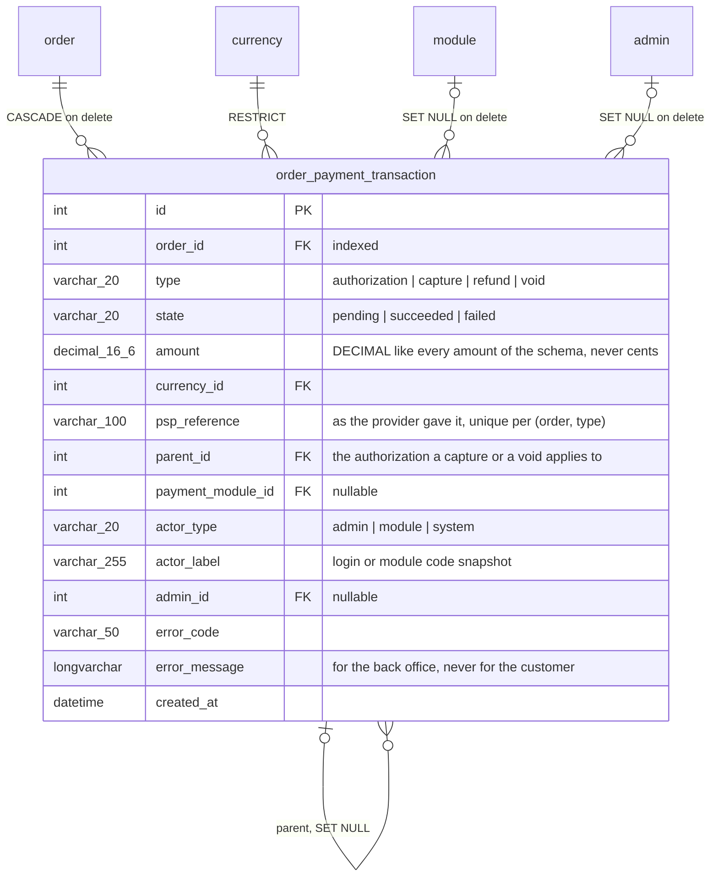
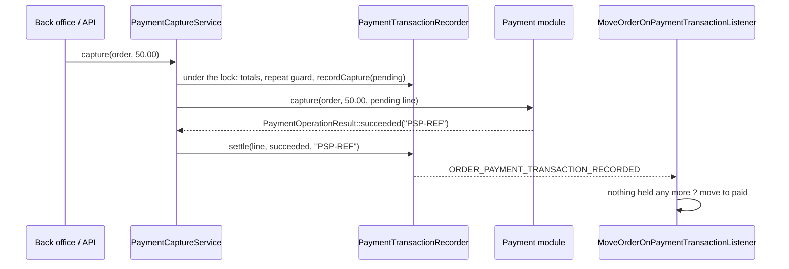

# Payment journal and deferred capture

Every money movement on an order — an authorization, a capture, a refund, a
void — is written to a journal the moment it happens, with its amount, its
currency, its outcome, the reference the provider gave it and who did it. A
payment module that reserves the amount first and takes it later can say so,
and the core then offers the capture, checks it against what the authorization
holds, writes it and moves the order along.

This document is the map for developers who work on the feature. The behavior
itself is specified by the test suites named below.

## Data model

One new table. The author is denormalized the way `order_history` does it:
`actor_label` survives the deletion of the admin, and the payment module is
kept by id while it is installed.

The types and states are the enums `Thelia\Domain\Payment\Enum\PaymentTransactionType`
and `PaymentTransactionState`; the columns stay plain VARCHARs so a screen can
render a value it does not know with its raw code. `order.transaction_ref` is
not touched: it still carries the reference of the main payment, for the
modules, the themes and the PDF documents that read it there.

Amounts are DECIMAL strings on the model and floats in the rest of the core.
`Thelia\Domain\Payment\Service\PaymentAmount` carries them as whole millionths in
an integer — a decimal string parsed digit by digit, a float rounded to six
decimals first — so neither representation is ever compared to the other with
`===`. An amount the column cannot hold (more than ten digits before the point)
or that is not a finite number is refused with `InvalidPaymentAmountException`
rather than wrapped around. `CurrencyMinorUnit` reads the decimals of the order
currency from its ISO code through intl (two for EUR, none for JPY, three for KWD).

## How a line gets written

`Thelia\Domain\Payment\Service\PaymentTransactionRecorder` is the only writer.
It has one method per movement rather than a generic save, because each one
knows what it has to check:

- `recordAuthorization()` needs a positive amount **and the provider
  reference** (`MissingProviderReferenceException`): without it a replayed
  notification cannot be told from a second authorization.
- `recordCapture()`, `recordRefund()` and `recordVoid()` need the provider reference for an
  outcome, succeeded or failed (`MissingProviderReferenceException`): without
  it a replayed notification cannot be told from a second movement of the same
  amount. Only a pending line, written by the core before the provider is
  called, goes without one.
- `recordCapture()` refuses, with `CaptureExceedsAuthorizationException`, a
  pending or succeeded capture above what the authorization still holds. An
  order with no authorization is a module that took the price at once: its
  capture is the payment itself and is not checked against anything. Zero is a
  valid capture — an order that costs nothing is paid without taking anything.
- `recordRefund()` refuses an amount above what was taken and not yet given
  back, refunds still pending counted as given. The refund itself, towards the
  provider, belongs to another feature; this is only the line.
- `recordVoid()` writes what the authorization still held, captures still
  pending set aside, so the totals read zero left afterwards. A void the journal
  already knows — by its reference, or as the one pending void still waiting for
  it — is answered with its own amount, not with what is left once it counts.
- `settle()` gives a pending line its outcome, `attachReference()` the reference
  the provider answered with, `markOutcomeUnknown()` the reason its outcome is
  not known. These are the only changes a line ever receives. A line already
  settled the same way, under the same reference, is answered as it is: the
  module's answer and the provider's notification may both bring the outcome.
  A succeeded outcome needs the provider reference, given or already carried
  (`MissingProviderReferenceException`); a reference the line carries is never
  replaced. Each of these reads the line afresh under the lock, and
  `markOutcomeUnknown()` only ever annotates a line still pending: a stale object,
  or one whose save failed — which Propel would then silently ignore — is never
  written through. A reference holds at most 100 characters.

**Pending lines reserve.** `PaymentTransactionTotalsReader` adds up the
succeeded lines and, apart, the pending ones. A pending capture is not reported
as captured, but what it asked for is out of the remainder: a capture whose
provider has not answered may already have taken the money.

**Every check runs under the lock of the order's journal** (`PaymentJournalLock`,
a named database lock `thelia_order_payment:<order id>` taken through the
shared `Thelia\Domain\Order\Service\OrderLock`), with the write that depends on
it. The lock is insisted on: a worker that does not get it within five seconds
writes nothing and gets `PaymentJournalBusyException`. The server counts a lock
taken twice by the same connection, so code holding it calls code that takes it.

**Replays.** A movement reported again is answered with the line already
written, and `ORDER_PAYMENT_TRANSACTION_RECORDED` is raised again for it, so a
notification that failed half way — the line written, the order not moved —
heals when the provider replays it. A line with a reference is found by it, the
unique index `(order_id, type, psp_reference)` backing the lookup; the column
has a binary collation, provider references being case-sensitive. Only the
capture written for a module that keeps no journal goes without a reference, and
is found by type, outcome and amount within the last minute. A pending line that a notification reports with an outcome is settled.
A notification whose reference the journal does not know settles the one
pending line of the same movement and amount still waiting for a reference — a
call that timed out, or whose answer could not be recorded, leaves exactly
that — and is never guessed between two such lines.
A reference the journal holds with another outcome or another amount is refused
with `ConflictingPaymentReferenceException`: a new attempt carries a new
reference.

Every write, settlement and replay raises `ORDER_PAYMENT_TRANSACTION_RECORDED`
with an `OrderPaymentTransactionEvent` carrying the order and the line. Its
listeners must stand being called twice for the same line. The event is raised
once the outermost lock of the journal is released, with the order read afresh
in an object of its own — the caller's object, and what it has not saved yet, are
left alone, and it is not refreshed either: a caller that reads the status after
recording a line reads the order again:
its listeners call payment modules and move the order. A listener that fails
surfaces as `PaymentAnnouncementFailedException`, which carries the line — still
written — and is not a `PaymentException`: a notification ending on it is
answered as failed, so that the provider replays it.

A failure of the recorder is **not** swallowed, unlike an order history entry: a
payment whose trace cannot be written is a payment the merchant cannot account
for. The recorder is not called inside a database transaction the caller
opened: the lock would be released before that transaction commits.

## Modules that declare nothing

A module that takes the price at once tells the core nothing but "paid",
through the order status. `RecordImmediateCaptureListener` listens to
`ORDER_UPDATE_STATUS` at priority 4 — after the core has saved the status and
after every core listener of it (history and invoice numbering at 64, coupons at
10, status actions at 5) — and, the first time an order reaches a paid status
coming from an unpaid one, writes a succeeded capture of the order total,
carrying the transaction reference the module saved on the order, authored by
the module (or by the administrator who marked the order paid). Cheque,
FreeOrder and every published module get their line without a line of code.

Nothing is written for a module that implements the capture interface and
answers `supportsDeferredCapture()`, nor when the journal already holds an
authorization or a capture, succeeded or pending, whatever wrote them: an open
authorization is not taken by marking the order paid, and a module that writes
its own captures keeps a single line. A failure here is logged and the status
change goes on: the status is committed, and a notification answered with an
error would be retried on an order already paid. Such an order keeps no capture
line — a replayed notification finds it already paid — and the log is where
the merchant learns it.

## Deferred capture

A module that reserves the amount first implements
`Thelia\Module\PaymentModuleWithCaptureInterface`. It is not part of
`PaymentModuleInterface` on purpose: adding a method to an interface every
published module implements would break them all.

- `supportsDeferredCapture()` says whether, as currently configured, the module
  authorizes first. A module can expose that choice to the merchant.
- The module is called through `PaymentModuleLocator`: the instance the
  container built, so `getContainer()` works in it. A deactivated module is not
  called: its services are no longer compiled, and the refusal names it.
- The module writes the **authorization** itself, through the recorder, when
  the provider confirms it — typically from its notification controller — with
  the provider reference.
- `capture(Order, float $amount, OrderPaymentTransaction $pending)` and
  `voidAuthorization(Order, OrderPaymentTransaction $pending)` call the
  provider and answer a `PaymentOperationResult`: succeeded with the provider
  reference, failed with the provider's code and message, or pending when the
  outcome will only come with a later notification — the module then reports it
  through the recorder under the reference it answered with, which settles the
  pending line.
- A `PaymentRefusedException` thrown by the module is a refusal: the line is
  settled as failed with its message, and the exception rethrown. Any other
  exception — a timeout, a broken connection, an answer it could not read, a
  plain `PaymentException` included — leaves the line **pending**: the call may
  have reached the provider. The technical message goes to the log, never to the
  journal every order reader sees, which gets a generic one, and the caller gets
  a `PaymentProviderUnreachableException` saying so, the original as previous.
- A module that answers with a reference another line of the order already
  carries leaves the line pending as well, annotated `conflicting_reference`:
  whether the provider took the money that time cannot be told, and the
  notification bringing the real reference settles it.
- Once the provider has answered, nothing that follows reports the movement as
  failed: a listener of the journal that breaks is logged, and a journal another
  worker holds past the wait leaves the line pending, annotated `journal_busy`
  with the provider's answer, for the notification to settle. A module that
  answers succeeded without the provider reference leaves it pending as well,
  annotated `missing_reference`, and one whose reference is longer than the
  100 characters the journal holds, annotated `invalid_reference`, for the
  merchant to settle by hand; a refusal with such a reference is settled as
  failed without it. A failure of the database while the status is read under
  the row lock rolls the transaction back, a refusal closes it as it is.

`Thelia\Domain\Payment\Service\PaymentCaptureService::capture(Order, ?float)`
is what the back office and the admin API call, through the
`ORDER_PAYMENT_CAPTURE` event (`OrderPaymentCaptureEvent`, null amount for the
whole remainder, rounded down to the smallest coin). Under the journal lock it
reads the totals, refuses an amount that is not positive, has more decimals than
the currency or exceeds the remainder **before anything leaves the shop**,
refuses the same amount asked again within a minute (`DuplicateCaptureException`),
and writes the capture as pending with the latest authorization as its parent.
Outside the lock it calls the module, then settles the line with the answer.
`voidAuthorization()` works the same way.

## Refunds

A module that gives money back through its provider implements
`Thelia\Module\PaymentModuleWithRefundInterface` (`supportsRefund()`,
`refund(Order, float $amount, OrderPaymentTransaction $pending, RefundReason $reason, ?string $comment)`),
optional like the capture. `Thelia\Domain\Payment\Service\PaymentRefundService`
is what the back office calls, through the `ORDER_PAYMENT_REFUND` event
(`OrderPaymentRefundEvent`, null amount for everything still refundable):

- what can be given back is read in the journal — captured, less refunded, less
  the refunds waiting for their answer — never in the order total, which a partly
  captured order does not match;
- under the journal lock it refuses an amount that is not positive, has more
  decimals than the currency or exceeds what is refundable, and the same amount
  asked again within a minute (`DuplicateRefundException`), then writes the
  refund as pending with the latest capture as its parent;
- the module is called outside the lock and its answer recorded as for a capture
  (`ProviderCallRunner`): a `PaymentRefusedException` leaves a failed line, any
  other exception leaves it pending;
- a module that cannot refund, is deactivated or is no longer installed is
  refused with `RefundNotSupportedException`, which names it. Modules are always
  called through `PaymentModuleLocator`, which hands them their container.

A refund made outside the provider — a bank transfer, a cheque — is recorded with
`recordOfflineRefund()` (the event with `$offline` true), whatever the module: a
succeeded refund line with a reference of its own (`offline-…`), the error code
`PaymentRefundService::ERROR_CODE_OFFLINE` and the merchant's comment. The reason
is one of a short fixed list (`RefundReason`: returned, missing or damaged,
commercial gesture, cancellation, other); the comment is cleaned and cut to 255
characters before it reaches the provider.

`ORDER_REFUNDED` (`OrderRefundedEvent`: the order, the line, the reason, the
comment, whether it was made outside the provider) is sent once money was given
back, for credit note and accounting modules. The service never moves the order:
once everything collected was given back and no refund waits for its answer, the
journal moves a paid order to `refunded`, through the transition graph, as it
moves it to `paid` after a capture. A partial refund leaves the order as it is.
Giving money back is a right of its own, `admin.order.payment-refund`.

## Statuses

`MoveOrderOnPaymentTransactionListener` moves the order along with the money,
through `ORDER_UPDATE_STATUS`, so the stock, the invoice numbering and the
history see each move like any other:

- a succeeded **authorization** puts an unpaid order (not paid, cancelled or
  refunded, custom equivalents included) in `awaiting_capture`;
- once the authorization holds nothing more — everything captured, or the rest
  released by a succeeded **void** — and no capture or void waits for its
  answer, the order is `paid` if anything was taken and back to `not_paid` if it
  was all released. A remainder smaller than the smallest coin of the currency
  counts as nothing left;
- a capture on an order with no authorization moves nothing: that module says
  "paid" itself.

The journal is the truth and the status follows it. Each move is dispatched with
the status it was decided on (`OrderEvent::expectStatus()`): `Action\Order`
reads the status under a row lock before writing, and drops — stopping the
event — a move whose status another worker has changed since, so two
notifications never pay the order twice nor put a cancelled order back on hold.
Every status change is now decided on the status read under that lock, not on
the object the caller loaded, and the history records the status the order left
as read there. A refusal of the graph writes nothing and closes the transaction
without rolling it back. `ORDER_UPDATE_STATUS` is not meant to be dispatched
inside a transaction the caller holds open: the row lock would last until that
caller commits, while the payment listeners take the journal lock — a worker
recording a line on the same order then waits up to five seconds and the
immediate capture line is lost (logged). A move the transition graph
refuses is logged and not made, and a status listener that fails is logged: the
line stays written and the provider's notification is answered.

Cancelling an order whose authorization still holds an amount releases it
through the module (`VoidAuthorizationOnCancelListener`, priority 3); a module
that cannot is logged for the merchant to release it at the provider. An
authorization the provider confirms after the order was cancelled is released
the same way. An administrator cancels such an order only with the capture
right (`AuthorizedOrderCancellationGuard`, checked at priority 160 before the
status is written, and by the admin API before anything of the request is):
releasing the amount is a decision on the money. A module, a customer or the
shop itself is not asked.

An order on hold for capture keeps the stock as its placement left it: a move
between two statuses that both stand for `not_paid` is stock-neutral, and the
stock-on-creation flag of the payment module still applies until the order
leaves those statuses.

A payment module that maps movements to statuses in its own configuration
implements `Thelia\Module\PaymentModuleManagingOrderStatusInterface` and answers
`managesOrderStatus()` with true: its journal lines are written as usual, and the
core leaves the status of its orders alone.

An authorization that lapses at the provider before it was all captured is
recorded with `recordExpiry()`: a void of what it still held, annotated with the
error code `PaymentTransactionRecorder::REASON_EXPIRED`, carrying the
authorization's reference when the provider gives the lapse none of its own. What
was captured stays; the order follows as for any void. The back office reads it
as "Authorization expired", not as a failure.

`awaiting_capture` (`OrderStatus::CODE_AWAITING_CAPTURE`) is **not** a canonical
status. It is seeded at install, and by `3.3.0.sql`, as a custom status
equivalent to `not_paid`, so `isPaid(false)`, `isNotPaid(false)` and the
modules reading them keep their answer, and `OrderStatus::CANONICAL_CODES` is
unchanged. A merchant may rename it or delete it; the core looks it up by code
and leaves an authorized order unpaid when it is gone.

The checkout does not read `isPaid()` for this: `Order::isPaymentSecured()`
answers true for an order paid, refunded, on hold for capture, or whose journal
still holds an authorized or pending amount, an authorization awaiting its
answer included, or money taken and not given back whatever the status says;
never for a cancelled order. A payment marked paid by mistake is therefore
corrected by a refund line, not by setting the order back to not paid, which
leaves the capture counted; and an authorization a module writes as pending
before redirecting the buyer keeps the cart consumed until the provider
answers or the merchant settles it. The failed-payment cancellation of
the checkout refuses a secured order. `OrderFacade::findUnpaidOrderOf()`
and the session's paid-cart check read it, so an authorized order is neither
presented to its module again nor cancelled for a new one — which would reserve
the amount twice on the buyer's card — and its cart is consumed.

## Rights

The refund is a third right, `admin.order.payment-refund`
(`AdminResources::ORDER_PAYMENT_REFUND`), granted to no profile by the update.

Reading the journal goes with reading orders (`admin.order`). Taking money is
a right of its own, `admin.order.payment-capture`
(`AdminResources::ORDER_PAYMENT_CAPTURE`), granted profile by profile, the way
forcing a status transition already is. The same right is asked to cancel an
order whose authorization still holds an amount, and to record by hand the
outcome of a pending line.

## Security notes

- The journal holds provider references and error messages, never card data,
  cryptograms or reusable tokens. `psp_reference` is capped at 100 characters
  to discourage storing a whole payload there.
- A provider error message is stored as the provider sent it, for the back
  office; it is never shown to the customer and must be escaped when rendered.
- The capture amount is checked in the service, against the journal, not in
  the screen.

## Admin API

Three operations, none of them on the front API — a customer sees whether the
order is paid, which the order already exposes:

- `GET /api/admin/orders/{orderId}/payment_transactions` — the journal, latest
  first, twenty per page (`Thelia\Api\Resource\OrderPaymentTransaction`, read
  only, `admin.order` right).
- `GET /api/admin/orders/{orderId}/payment` — the totals (`pendingCapture`
  apart) and whether the module `supportsCapture` (`OrderPaymentSummary`,
  `admin.order` right).
- `POST /api/admin/orders/{orderId}/capture` with `{"amount": 50}` or `{}` —
  the capture, answered 201 with the journal line
  (`OrderPaymentCapture`, mapped to the `admin.order.payment-capture` right
  with create access). The processor goes through `ORDER_PAYMENT_CAPTURE`, so it
  shares every guard of the capture service with the back office. A repeated
  amount within a minute, or a journal another worker is writing, is a 409; a
  module that could not reach its provider (`PaymentProviderUnreachableException`)
  a 502 with a generic message, the capture staying pending; any other
  `PaymentException` a 422. Anything else is a fault of the shop, answered 500. `amount` is bounded
  by what the column holds. The global admin API rate limit applies on top.

An administrator authenticated by a JWT holds no back-office session:
`OrderHistoryActorResolver` reads the Symfony security token first, so the line
is the administrator's, for the payment journal and the order history alike,
even when the browser also holds a back-office session. Outside the back office,
a module that names itself is the author over an administrator in session.

A status change written through `PUT /api/admin/orders/{id}` checks the
transition graph and the cancellation right before anything of the request is
written, then moves the status once the other fields are committed.

## Back office

The payment card of the order sheet (`order/detail.html.twig` of the Twig
theme) includes `order/_payment_journal.html.twig`: the totals when an
authorization exists or the module can capture, what waits for the provider, a
notice that marking the order paid by hand takes nothing while the
authorization still holds an amount, the *Capture payment* button, and the
journal table, newest first. `OrderPaymentContextBuilder` composes it from
`OrderPaymentTransactionRepository` (the reads), `OrderPaymentLinePresenter`
(labels, badges, author in clear) and the core totals reader; it returns an
empty, disabled block to an administrator without the orders permission, the
way the history block does. The button, and the dialog
`order/_payment_capture_modal.html.twig`, only exist for an administrator
holding the capture right (create on `admin.order.payment-capture`) when the
module supports deferred capture and at least a smallest coin is left; the
dialog is prefilled with the remainder rounded down to it.

A pending line the provider never confirmed shows, to an administrator holding
the capture right, a form to record the outcome read in the provider's back
office, with its reference: `OrderController::settlePaymentTransaction()`
answers `POST /admin/order/update/{order_id}/payment-transaction/{id}/settle`
through the `ORDER_PAYMENT_TRANSACTION_SETTLE` event
(`OrderPaymentSettlementEvent`); the line is annotated `settled_by_hand`, its note
names the administrator, and the administration log keeps the same. That note
is free text: it stays when the administrator account is deleted. A listener of
the journal that fails afterwards is logged; the settlement is reported, and
logged, as done. A bulk
cancellation that meets an order still holding an authorization, without the
capture right, leaves it and says why. Amounts are read and typed in the decimals
of the order currency.

`OrderController::capturePayment()` answers `POST
/admin/order/update/{order_id}/payment-capture`: the capture right first, then
the shape of the typed amount (a comma counts as a decimal separator, empty
means the remainder), then `AdminFormAction::tokenAction()` with the CSRF
token, the `ORDER_PAYMENT_CAPTURE` event and an administration log line naming
the order, the amount and the outcome. A double submit is refused by the
capture service as a repetition; a refusal from the core comes back as the
usual error flash. Only the payment rules word what the administrator reads: any
other failure — a module listening to the capture, say — is shown as an internal
error, its message going to the log. A trusted failure is shown as worded even
when it wraps a technical one.

## Installation and update

A fresh install creates the table and seeds the status and the right
(`setup/thelia.sql`, `setup/insert.sql`). An installed shop gets them from
`setup/update/sql/3.3.0.sql`: the table empty, the status appended after the
existing ones, the right with its titles. Orders placed before the update keep
their transaction reference and show no movement until their next payment
event; the demonstration database has no journal either, and the screens must
render an empty one without error.

## Test suites

- `tests/Unit/Domain/Payment/PaymentAmountTest.php` — comparisons at the
  precision of the column, the overflow refused.
- `tests/Unit/Domain/Payment/CurrencyMinorUnitTest.php` — decimals per
  currency, the smallest coin.
- `tests/Unit/Domain/Payment/PaymentTransactionTotalsTest.php` — what is left
  to capture or to refund, pending lines reserving.
- `tests/Integration/Domain/Payment/PaymentTransactionRecorderTest.php` — one
  line per movement, the capture and refund ceilings, partial capture then
  balance, replays (healing after a listener failure, conflicting references,
  a pending line settled by its notification), case-sensitive references, the
  status rules, a transition the graph refuses, the actor.
- `tests/Integration/Domain/Payment/ImmediateCaptureTest.php` — Cheque and
  FreeOrder get their line; `order.transaction_ref` is untouched; paid to
  processing writes nothing more; no line on top of an open authorization or a
  module's own capture; the listener priority.
- `tests/Integration/Domain/Payment/PaymentCaptureServiceTest.php` — a module
  that defers its capture, through `tests/Support/Payment/DeferredCapturePaymentModule.php`:
  hold, capture, partial capture, refusal, unknown outcome left pending,
  pending reserving, repetition, currency precision, void during a pending
  capture, release on cancellation, a module that cannot load.
- `tests/Integration/Domain/Payment/AuthorizedOrderCheckoutTest.php` — an
  authorized order is not the unpaid order of its cart.
- `tests/Http/BackOffice/OrderPaymentBackOfficeTest.php` — the payment card:
  the cheque line, the empty journal, the totals, the prefilled dialog and its
  rounding, the hold notice, the capture from the dialog and its log line, a
  partial capture typed with a comma, the refusals, a forged token, a double
  submit, and who sees or may use the button.
- `tests/Api/Admin/OrderPaymentApiTest.php` — the three admin operations:
  shape of a line, scope, the totals, the capture and its refusals, the repeat
  guard, a retried capture while the first is pending, the amount bound, and
  who is refused (anonymous, a customer token, order readers without the
  capture right, the capture right alone).
