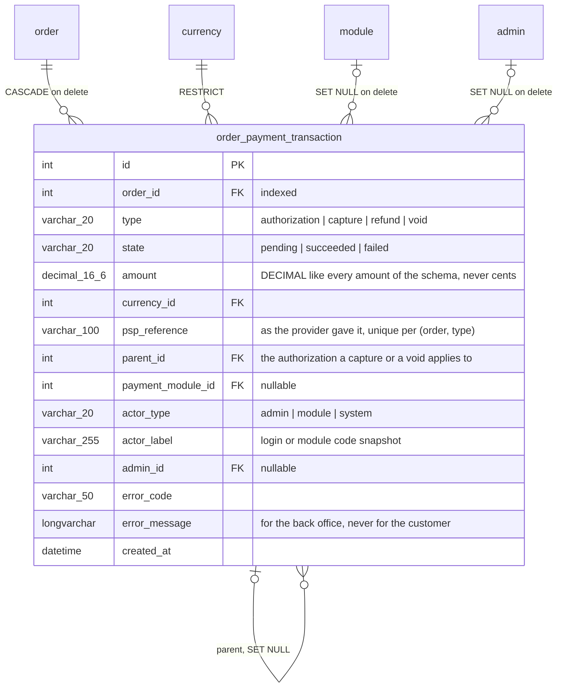
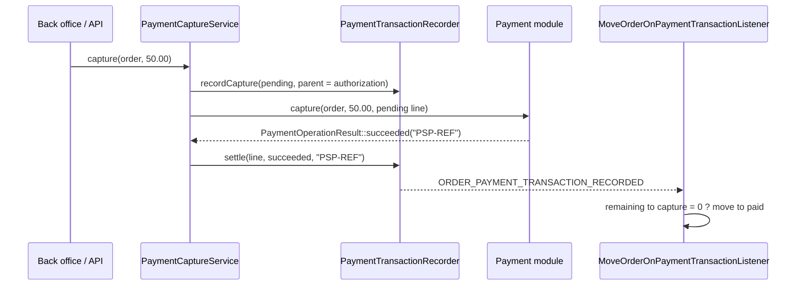

# Payment journal and deferred capture

Every money movement on an order — an authorization, a capture, a refund, a
void — is written to a journal the moment it happens, with its amount, its
currency, its outcome, the reference the provider gave it and who did it. A
payment module that reserves the amount first and takes it later can say so,
and the core then offers the capture, checks it against what the authorization
holds, writes it and moves the order along.

This document is the map for developers who work on the feature. The behavior
itself is specified by the test suites named below.

## Data model

One new table. The author is denormalized the way `order_history` does it:
`actor_label` survives the deletion of the admin, and the payment module is
kept by id while it is installed.

The types and states are the enums `Thelia\Domain\Payment\Enum\PaymentTransactionType`
and `PaymentTransactionState`; the columns stay plain VARCHARs so a screen can
render a value it does not know with its raw code. `order.transaction_ref` is
not touched: it still carries the reference of the main payment, for the
modules, the themes and the PDF documents that read it there.

Amounts are DECIMAL strings on the model and floats in the rest of the core.
`Thelia\Domain\Payment\Service\PaymentAmount` compares and adds them in whole
millionths, so neither representation is ever compared to the other with `===`.

## How a line gets written

`Thelia\Domain\Payment\Service\PaymentTransactionRecorder` is the only writer.
It has one method per movement rather than a generic save, because each one
knows what it has to check:

- `recordAuthorization()` needs a positive amount.
- `recordCapture()` refuses, with `CaptureExceedsAuthorizationException`, a
  pending or succeeded capture above what the authorization still holds. An
  order with no authorization is a module that took the price at once: its
  capture is the payment itself and is not checked against anything. Zero is a
  valid capture — an order that costs nothing is paid without taking anything.
- `recordRefund()` refuses an amount above what was taken and not yet given
  back. The refund itself, towards the provider, belongs to another feature;
  this is only the line.
- `recordVoid()` writes what the authorization still held, so the totals read
  zero afterwards.
- `settle()` gives a pending line its outcome. It is the only change a line
  ever receives: a line written before the provider is called, so that a call
  that never comes back still leaves its trace, is settled once with the answer.

A provider reference already in the journal for the same movement type on the
same order writes nothing: the line that carries it is answered instead. The
check is backed by the unique index on `(order_id, type, psp_reference)`, so two
notifications of the same movement handled at the same instant leave one line
whichever wins the race. A line without a reference — the capture written for a
module that keeps no journal — is guarded by a named database lock on the
order, taken for two seconds at most and not insisted on.

Every write, and every settlement, raises `ORDER_PAYMENT_TRANSACTION_RECORDED`
with an `OrderPaymentTransactionEvent` carrying the order and the line.

A failure of the recorder is **not** swallowed, unlike an order history entry: a
payment whose trace cannot be written is a payment the merchant cannot account
for.

## Modules that declare nothing

A module that takes the price at once tells the core nothing but "paid",
through the order status. `RecordImmediateCaptureListener` listens to
`ORDER_UPDATE_STATUS` at priority 64 — after the core has saved the status —
and, the first time an order reaches a paid status coming from an unpaid one,
writes a succeeded capture of the order total, carrying the transaction
reference the module saved on the order, authored by the module (or by the
administrator who marked the order paid). Cheque, FreeOrder and every published
module get their line without a line of code. A module that implements the
capture interface and answers `supportsDeferredCapture()` is left alone: it
writes its own lines.

## Deferred capture

A module that reserves the amount first implements
`Thelia\Module\PaymentModuleWithCaptureInterface`. It is not part of
`PaymentModuleInterface` on purpose: adding a method to an interface every
published module implements would break them all.

- `supportsDeferredCapture()` says whether, as currently configured, the module
  authorizes first. A module can expose that choice to the merchant.
- The module writes the **authorization** itself, through the recorder, when
  the provider confirms it — typically from its notification controller.
- `capture(Order, float $amount, OrderPaymentTransaction $pending)` and
  `voidAuthorization(Order, OrderPaymentTransaction $pending)` call the
  provider and answer a `PaymentOperationResult`: succeeded with the provider
  reference, failed with the provider's code and message, or pending when the
  outcome will only come with a later notification — the module then settles the
  line itself.

`Thelia\Domain\Payment\Service\PaymentCaptureService::capture(Order, ?float)`
is what the back office and the admin API call, through the
`ORDER_PAYMENT_CAPTURE` event (`OrderPaymentCaptureEvent`, null amount for the
whole remainder). It checks the module, reads the totals, refuses an amount
above the remainder **before anything leaves the shop**, writes the capture as
pending with the latest authorization as its parent, calls the module, and
settles the line with the answer — as failed, with the exception message, when
the module throws, and the exception is rethrown.

## Statuses

`MoveOrderOnPaymentTransactionListener` moves the order along with the money,
through `ORDER_UPDATE_STATUS`, so the transition graph, the stock, the invoice
numbering and the history see each move like any other:

- a succeeded **authorization** puts an unpaid order (not cancelled, not
  refunded) in `awaiting_capture`;
- the succeeded **capture** of the last amount held makes it `paid`; a capture
  on an order with no authorization moves nothing, that module says "paid"
  itself;
- a succeeded **void** sends an order in `awaiting_capture` back to `not_paid`.

`awaiting_capture` (`OrderStatus::CODE_AWAITING_CAPTURE`) is **not** a canonical
status. It is seeded at install, and by `3.3.0.sql`, as a custom status
equivalent to `not_paid`, so `isPaid(false)`, `isNotPaid(false)` and every
module reading them keep their answer, and `OrderStatus::CANONICAL_CODES` is
unchanged. A merchant may rename it or delete it; the core looks it up by code
and leaves an authorized order unpaid when it is gone.

## Rights

Reading the journal goes with reading orders (`admin.order`). Taking money is
a right of its own, `admin.order.payment-capture`
(`AdminResources::ORDER_PAYMENT_CAPTURE`), granted profile by profile, the way
forcing a status transition already is.

## Security notes

- The journal holds provider references and error messages, never card data,
  cryptograms or reusable tokens. `psp_reference` is capped at 100 characters
  to discourage storing a whole payload there.
- A provider error message is stored as the provider sent it, for the back
  office; it is never shown to the customer and must be escaped when rendered.
- The capture amount is checked in the service, against the journal, not in
  the screen.

## Admin API

Three operations, none of them on the front API — a customer sees whether the
order is paid, which the order already exposes:

- `GET /api/admin/orders/{orderId}/payment_transactions` — the journal, latest
  first, twenty per page (`Thelia\Api\Resource\OrderPaymentTransaction`, read
  only, `admin.order` right).
- `GET /api/admin/orders/{orderId}/payment` — the totals and whether the module
  `supportsCapture` (`OrderPaymentSummary`, `admin.order` right).
- `POST /api/admin/orders/{orderId}/capture` with `{"amount": 50}` or `{}` —
  the capture, answered 201 with the journal line
  (`OrderPaymentCapture`, mapped to the `admin.order.payment-capture` right
  with create access). The processor goes through `ORDER_PAYMENT_CAPTURE`, so a
  module listening to the event sees the back office and the API alike. A
  `PaymentException` is a 422; the same explicit amount asked again on the
  order within a minute, after a capture that did not fail, is a 409 rather
  than a second capture — the client that retried a timed-out call reads the
  journal instead. The global admin API rate limit applies on top.

An administrator authenticated by a JWT holds no back-office session:
`OrderHistoryActorResolver` reads the Symfony security token when the session
has no admin, so the line is the administrator's, for the payment journal and
the order history alike.

## Back office

The payment card of the order sheet (`order/detail.html.twig` of the Twig
theme) includes `order/_payment_journal.html.twig`: the totals when an
authorization exists or the module can capture, the *Capture payment* button,
and the journal table, newest first. `OrderPaymentContextBuilder` composes it
from `OrderPaymentTransactionRepository` (the reads), `OrderPaymentLinePresenter`
(labels, badges, author in clear) and the core totals reader; it returns an
empty, disabled block to an administrator without the orders permission, the
way the history block does. The button, and the dialog
`order/_payment_capture_modal.html.twig`, only exist for an administrator
holding the capture right (create on `admin.order.payment-capture`) when the
module supports deferred capture and something is left.

`OrderController::capturePayment()` answers `POST
/admin/order/update/{order_id}/payment-capture`: the capture right first, then
the shape of the typed amount (a comma counts as a decimal separator, empty
means the remainder), then `AdminFormAction::tokenAction()` with the CSRF
token, the `ORDER_PAYMENT_CAPTURE` event and an administration log line naming
the order, the amount and the outcome. A refusal from the core (above the
authorization, nothing to capture) comes back as the usual error flash.

## Installation and update

A fresh install creates the table and seeds the status and the right
(`setup/thelia.sql`, `setup/insert.sql`). An installed shop gets them from
`setup/update/sql/3.3.0.sql`: the table empty, the status appended after the
existing ones, the right with its titles. Orders placed before the update keep
their transaction reference and show no movement until their next payment
event; the demonstration database has no journal either, and the screens must
render an empty one without error.

## Test suites

- `tests/Unit/Domain/Payment/PaymentAmountTest.php` — comparisons at the
  precision of the column.
- `tests/Unit/Domain/Payment/PaymentTransactionTotalsTest.php` — what is left
  to capture.
- `tests/Integration/Domain/Payment/PaymentTransactionRecorderTest.php` — one
  line per movement, the capture ceiling, partial capture then balance, replayed
  references, a failed line that moves nothing, the actor.
- `tests/Integration/Domain/Payment/ImmediateCaptureTest.php` — Cheque and
  FreeOrder get their line; `order.transaction_ref` is untouched; paid to
  processing writes nothing more.
- `tests/Integration/Domain/Payment/PaymentCaptureServiceTest.php` — a module
  that defers its capture, through `tests/Support/Payment/DeferredCapturePaymentModule.php`:
  authorization puts the order on hold, the capture from the back office pays
  it, a partial capture leaves the rest, a provider refusal leaves it unpaid,
  an amount above the authorization is refused before the module is called.
- `tests/Http/BackOffice/OrderPaymentBackOfficeTest.php` — the payment card:
  the cheque line, the empty journal, the totals and the prefilled dialog, the
  capture from the dialog and its log line, a partial capture typed with a
  comma, the refusals, and who sees or may use the button.
- `tests/Api/Admin/OrderPaymentApiTest.php` — the three admin operations:
  shape of a line, scope, the totals, the capture and its refusals, the repeat
  guard, and who is refused (anonymous, order readers without the capture
  right, the capture right alone).
