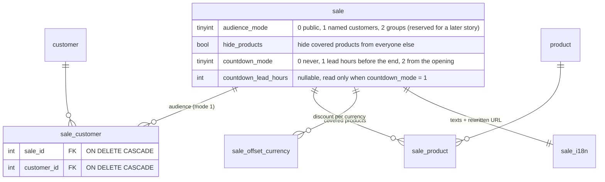
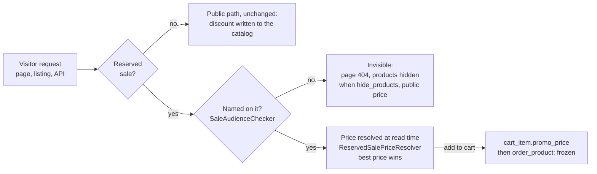
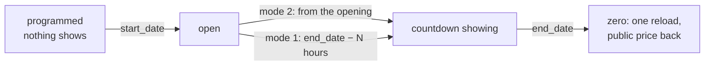

# Reserved sales and countdown display

A sale (commercial operation) can be public, as it always was, or reserved for
named customers. A reserved sale is invisible to anyone it is not open to: its
page answers 404, its discount is never served, and — when the merchant enables
`hide_products` — the products it covers disappear from listings, the front API,
the sitemap and the product page. A dated sale can also display a countdown on
the storefront: never, from N hours before the end date, or from its opening.

This document is the map for developers who work on the feature. The behavior
itself is specified by the test suites named below.

## Data model

Two things changed in the schema: four settings columns on `sale`, and the
`sale_customer` link table. The reserved price is deliberately absent from this
model — see the next section.

Both foreign keys cascade: deleting the last targeted customer (a GDPR purge,
for instance) silently empties the audience. The back office list therefore
shows the recipient count on every reserved sale and turns it into an alert at
zero. The `(active, audience_mode)` index carries the "is any reserved sale
running" short-circuit that keeps shops without reserved sales on their
historical query plans.

`audience_mode = 2` (customer groups) is modeled but not implemented: customer
groups do not exist in the core yet.

## Where the reserved price lives

A public sale writes its discount into the catalog
(`product_sale_elements.promo`, `product_price.promo_price`) when it activates.
A reserved sale never does: those two columns are what every visitor sees. Its
price is resolved at read time, for entitled customers only, and is only
persisted once the customer acts on it.

The moving parts, all under `Thelia\Domain\Sale`:

- `SaleDiscountCalculator` — the taxed-offset formula (taxed price, minus the
  offset, back to untaxed), extracted so the written path (`Action\Sale`) and
  the resolved path share one implementation to the cent.
- `SaleAudienceChecker` — is this customer named on that sale; is any reserved
  sale running. Memoized per request (`ResetInterface`).
- `ReservedSalePriceResolver` / `ReservedSalePriceCatalog` — batch resolution;
  the catalog memoizes the visitor's whole entitled set once per request so a
  listing costs no query per card.
- `ReservedSaleVisibility` — the single owner of the hiding rule, applied by the
  product loops, the front API extensions, the product view check and the theme
  sitemap. A product covered by two hidden sales stays visible to a customer
  named on either one.
- `CurrentCustomerProvider` — the visitor, read from the session first (the
  theme calls the API in process, where the token storage is empty), then from
  the JWT token storage (direct `/api/front` calls). Guest accounts are never
  entitled: a guest row is reusable by e-mail.

Entitlement is re-evaluated on every request, and the cart re-resolves on
login, on change and on restore: a customer who loses the right falls back to
the public price at the next cart refresh. An order keeps the price it was
placed at (`order_product.promo_price`, `was_in_promo`) — that is the proof of
the granted price.

The shared data-access cache would leak a per-customer price, so the
`/api/front/products` and `/api/front/product_sale_elements` prefixes bypass it
while a reserved sale is running — and only then. `/api/front/sales` is never in
the shared cache.

## Countdown

The decision is made on the server (`Sale::shouldDisplayCountdown()`): never
without an end date, never before the start date. What reaches the browser is a
remaining duration in seconds, not a date, so a wrong local clock cannot show a
negative countdown. The theme counts down on a monotonic clock
(`performance.now()`), one shared interval per page, resyncs when a throttled
background tab becomes visible again, and reloads once at zero. Closing the
sale (price back to normal) remains the job of the `sale:check-activation`
cron, as for every public sale.

## Surfaces

| Surface | What changed |
| --- | --- |
| `/api/front/sales` | New read-only resource: settings, remaining seconds, `productIds` (batch-preloaded), rewritten URL. The customer list never leaves the back office. Reserved sales are absent for anyone not named, 404 on item access. |
| `/api/front/products`, PSE | Hidden products filtered out (collection and item); reserved price served to entitled customers. |
| Product/PSE loops, `sale` loop | Same filters; the `sale` loop also exposes `URL` and the countdown outputs. Price *sorting* still uses the raw columns. |
| Rewritten URL | `sale` is a rewriting view; the URL is generated when the sale is created. |
| Product view | The view check answers 404 for a hidden product, like an invisible one. |
| Theme sitemap | Hidden products excluded. |
| Back office | Targeting block (public / named customers), shared customer picker (gated by the CUSTOMER right), countdown settings (refused without an end date), reserved badge with the recipient count. |

## Test map

- `tests/Unit/Domain/Sale/SaleDiscountCalculatorTest`, `tests/Unit/Model/SaleTest`
- `tests/Integration/Domain/Sale/` (audience, resolver, visibility)
- `tests/Integration/Action/ReservedSale*`, `ReservedProductViewCheckTest`
- `tests/Api/Front/{SaleApiTest, ReservedSaleVisibilityApiTest, ReservedSalePriceApiTest}`
- `tests/Http/Flexy/SaleShowcaseTest`, `tests/Unit/BackOfficeDefaultTwig/Form/SaleTypeTest`
- `tests/Playwright/specs/backoffice/sale-edit-twig.spec.ts`
