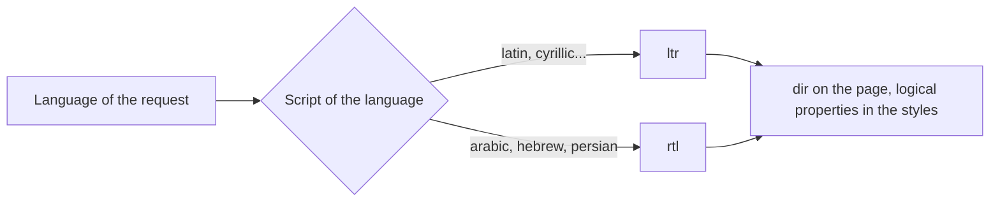
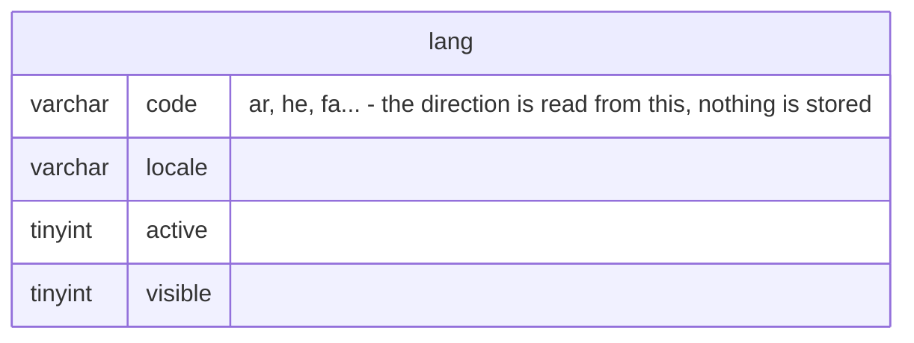

# Right-to-left shops

A shop served in Arabic, Hebrew or Persian reads from right to left, front office
and back office, without the integrator touching the theme. The reading direction
is deduced from the language and from nothing else: there is no setting, no column,
no migration, and an existing shop sees no change.

This document is the map for developers who work on the feature. The behavior
itself is specified by the test suites named below.

## Where the knowledge lives

`Thelia\Domain\Localization\Service\LocaleDirection` holds the list of languages
written right to left, the same way `EuropeanUnionCountries` holds the member
states: a linguistic fact a shop has no business editing, which ships with a core
update rather than with a database migration.



The match is made on the **language code alone**, never on the full locale:
`ar_SA` and `ar_MA` answer the same. Anything unknown, empty or malformed answers
`ltr` — the direction of a page is never a reason to fail.

## The database does not change

Nothing was added to the schema. `lang` carries no direction column, on purpose:
the direction of a script is not a merchant's decision, and making it editable
would let a shop contradict its own language. Adding a language written right to
left is what it always was — creating a row in `lang`.



## Reading the direction

| From | How |
|---|---|
| A Twig template | `lang_direction()`, a function registered on the Twig environment |
| A Twig template, legacy | `lang_direction`, a variable the parser assigns on its own renders |
| PHP, current language | `LocalizationFacade::getCurrentLangDirection(): string` |
| PHP, a raw locale | `LocaleDirection::forLocale(?string): string`, `isRightToLeft(?string): bool` |

Values are exactly `ltr` or `rtl`, never null, never empty. Outside a session - a
console command, a worker - the answer is the direction of the shop's default
language.

**`lang_direction()` is what a template should call.** It is declared by
`TwigEngine\Extension\LangDirectionExtension`, registered like every other extension
of the TwigEngine module, and therefore answers on the global Twig environment: the
front, the back-office, a live component, a macro, a template included with `only`.
It reads the current locale on each call.

`lang_direction`, the variable, is kept for the themes that already read it. It is
assigned by `TwigParser::render()` next to `lang_code`, which means it exists only
where that parser put it:

- a back-office controller renders with `$this->twig->render(...)` and never goes
  through the parser, so the variable is not there;
- a LiveComponent re-rendering on its own (`/_components`) renders from its own
  state, so the variable is not there either;
- a macro and an `include ... only` are compiled against an empty context by design.

In those places the variable is either missing or stale, while the function is
current. A theme that reads the variable should keep its fallback -
`{{ lang_direction|default('ltr') }}` - so a shop whose TwigEngine predates this
feature degrades to left-to-right instead of breaking.

A third-party theme inherits the mechanism and nothing forces it to use it: a theme
that calls neither the function nor the variable renders exactly as before.

The direction is a constant of the core. It is never derived from a request
parameter and never from an address: an URL chooses the language, never the
direction.

## What a theme has to do

Set the attribute once on the page shell, then write styles that follow the
reading direction instead of the screen:

```twig
<html lang="{{ lang_code }}" dir="{{ lang_direction() }}">
```

The front-office Flexy theme still writes `dir="{{ lang_direction|default('ltr') }}"`,
reading the parser variable; both spellings resolve to the same value on a page
rendered by the parser.

The rule of thumb used across the Flexy theme:

- **the direction comes from the reading direction** → logical property.
  `margin-inline-start`, `padding-inline`, `inset-inline-start`, `border-inline-end`,
  `text-align: start`; in Tailwind, `ms-`, `me-`, `ps-`, `pe-`, `start-`, `end-`,
  `text-start`, `border-s`, `rounded-e`.
- **the direction is a graphic choice** (an oriented gradient, a drop shadow, a
  computed absolute position, an icon rotation) → an explicit `rtl:` variant.

A directional icon is mirrored with `rtl:-scale-x-100` on the element wrapping it,
never by shipping a second set of SVG files. In Flexy, `Button`, `Link` and
`Tabulation` add it on their own when the icon name ends in `-left` or `-right`.

Values that must keep their own order inside right-to-left text — a price, a phone
number, a product reference, a tracking number, an e-mail address — are wrapped in
a container carrying `dir="ltr"`.

No parallel stylesheet is generated. Two artefacts would drift apart invisibly, and
a single sheet driven by the attribute costs nothing to maintain.

## What is not covered

PDF invoices and delivery notes, transactional e-mails, translating the Flexy theme
into a right-to-left language, and adding such a language to the default install.
Formatting numbers and dates in local digits is not covered either.

## Test suites

- `tests/Unit/Domain/Localization/LocaleDirectionTest.php`
- `tests/Unit/Domain/Localization/LocalizationFacadeDirectionTest.php`
- `tests/Integration/Domain/Localization/LangDirectionTemplateTest.php`
- `tests/Http/BackOffice/AdminWritingDirectionTest.php` - the served back-office page
- `tests/Playwright/specs/` - the right-to-left journey

In the TwigEngine module, which owns the function and the parser variable:

- `tests/LangDirectionExtensionTest.php`
- `tests/TwigParserLangDirectionTest.php`
